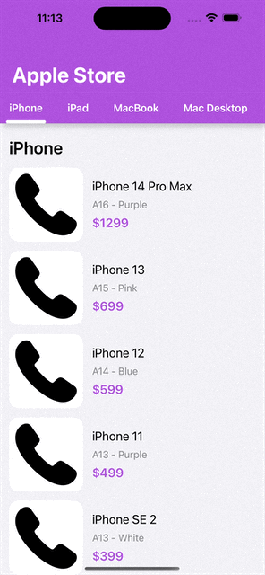

# Experiment of Sticky Header with auto scrollable Tabs (iOS)

An experiment code for creating a sticky header with auto scrollable tabs.

Source: [https://www.youtube.com/watch?v=XUeophZ1iTo](https://www.youtube.com/watch?v=XUeophZ1iTo)

## Requirements

- Xcode 14.2.0
